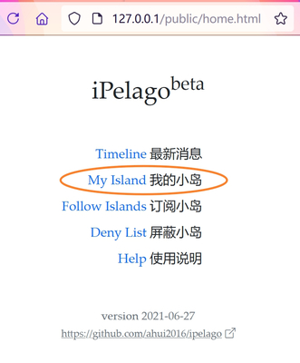

# 免费建岛

本文假设你已经安装 iPelago beta, 如未安装请看这里: [安装 iPelago beta](./setup.html)

## 生成 newsletter

1. 启动 iPelago beta, 打开首页后，如下图所示，点击 My Island.
   
2. 填写资料（必填项目只有一个，非常简单），点击 Create 按钮。
3. 建岛成功后点击 Publish 按钮，跳转后再点击 Download 按钮即可获得 newsletter.json 文件，将该文件上传到以下所示的其中一个平台上，就完成了第一次信息发布。

## 利用代码托管平台

注意：以下平台之中，国内平台可能提示实名认证，请认证，一般认证过程非常方便。如果不想实名认证可选择国外平台（但国外平台有可能访问困难）。

### GitHub.com

（注册及使用过程中可能需要翻墙和略懂英文。）

- 网址1: https://github.com/signup
- 网址2: https://github.com/new

1. 打开网址1，填写 email, 密码, 用户名等进行注册。
2. 注册后点击 Start a project 按钮或打开网址2，输入项目名称，选择 Public 后点击 Create repository 按钮。
3. 在仓库页面点击 Add file 按钮选择 Upload files, 上传 newsletter.json 文件，点击 Commit changes 按钮。
4. 在仓库的文件列表中会出现 newsletter.json 文件，点击它，再点击 raw 按钮，页面跳转后，浏览器的地址栏显示的网址就是你的小岛地址。
5. 前往 https://ipelago.ai42.xyz 提交你的小岛地址。完成。

### 华为云

- 

